<div align="center">

<!-- ═══ NAME BANNER — clear reveal animation, no blur ═══ -->


<!-- ═══ ROLE TYPEWRITER — single line, readable speed ═══ -->
[](https://git.io/typing-svg)

<!-- ═══ CONTACT BADGES ═══ -->
[](https://www.linkedin.com/in/gowtham-rajendran-ai)
[](mailto:gowtham27raja@gmail.com)
[](https://github.com/gowtham27rajendran-commits)
[](#)
[](#)

</div>

---

<!-- ═══ ABOUT ═══ -->

```python
gowtham = {
    "role"        : "Software Development Engineer",
    "focus"       : ["Distributed Systems", "Backend Engineering", "AI / LLM Engineering"],
    "stack"       : ["Java", "Python", "Spring Boot", "Kafka", "Spark",
                     "PostgreSQL", "Redis", "Docker", "Kubernetes", "AWS"],
    "experience"  : ["Nitro Solutions (UK)", "DRG (UK)", "Modern Infotech (India)"],
    "education"   : "MSc Advanced Computer Science · University of Strathclyde, Scotland",
    "dsa"         : "500+ problems solved",
    "location"    : "Coimbatore, India  |  Open to relocation",
}
```

---

<!-- ═══ ACHIEVEMENTS ═══ -->

<div align="center">


</div>

---

<!-- ═══ TECH STACK — animated staggered cards ═══ -->

<div align="center">


</div>

---

<!-- ═══ DSA PROFICIENCY ═══ -->

<div align="center">



</div>

---

## 💼 Experience

```
Sep 2024 – Present  ██████████████████████  Software Development Engineer · Nitro Solutions · Paisley, UK
                                             ↳ Event-driven ingestion pipeline — 30% fewer data inconsistencies
                                             ↳ p99 latency: query optimisation, N+1 elimination, Redis caching → ~20% reduction
                                             ↳ API contract testing · architecture reviews · production incident RCA

2023 – 2024         ████████████████        Junior Data Engineer · DRG · Glasgow, UK
                                             ↳ Spark pipelines processing millions of records/day
                                             ↳ Partition skew profiling + salting → 25% runtime reduction
                                             ↳ Automated data-quality gates: schema, null-rate, referential integrity

Nov 2021 – Jul 2022 ████████                Machine Learning Intern · Modern Infotech · Chennai, India
                                             ↳ Hybrid collaborative + content-based recommender → +25% new-user CTR
                                             ↳ A/B tested search ranking → 15% NDCG improvement
                                             ↳ BERT intent classifier fine-tuning → +20% accuracy
```

---

## 🚀 Projects

<table>
<tr>
<td width="50%" valign="top">

### [Distributed Order Processing](https://github.com/gowtham27rajendran-commits)


Kafka-based async order pipeline for high-traffic e-commerce. Idempotency keys via Redis deduplication, dead-letter queue handling, at-least-once processing with safe reprocessing.

</td>
<td width="50%" valign="top">

### [LLM Code Review Bot](https://github.com/gowtham27rajendran-commits/8-llm-code-review-bot)


GitHub App that reviews PRs using the Claude API. Parses diffs, scans for secrets, posts inline comments with severity scoring.

</td>
</tr>
<tr>
<td width="50%" valign="top">

### [Semantic Search Engine](https://github.com/gowtham27rajendran-commits/3-semantic-search-engine)


Sentence-transformers + FAISS ANN index. Understands meaning, not just keywords. Hybrid BM25 + semantic scoring via Reciprocal Rank Fusion.

</td>
<td width="50%" valign="top">

### [Fraud Detection System](https://github.com/gowtham27rajendran-commits/7-fraud-detection)


Three-layer detection: rule engine (<1ms) + XGBoost scorer + SHAP explainability. Velocity tracking and impossible-travel detection.

</td>
</tr>
<tr>
<td width="50%" valign="top">

### [Rate Limiter Service](https://github.com/gowtham27rajendran-commits/5-rate-limiter-service)


Four distributed algorithms — token bucket, sliding window log/counter, fixed window — backed by Redis Lua scripts for atomicity.

</td>
<td width="50%" valign="top">

### [Observability Platform](https://github.com/gowtham27rajendran-commits/10-observability-platform)


Three pillars: metrics (counters/gauges/histograms) + distributed traces (OpenTelemetry) + multi-window alerting with severity routing.

</td>
</tr>
</table>

<div align="center">

[](https://github.com/gowtham27rajendran-commits?tab=repositories)

</div>

---

## ⚙️ Engineering Principles

| Principle | In Practice |
|-----------|-------------|
| **Measure before optimising** | EXPLAIN ANALYZE before any query change. Spark UI partition profiling before repartitioning. |
| **Design for failure** | Idempotent writes, retry-safe consumers, DLQs, circuit breakers — before the incident, not after. |
| **Automate quality gates** | Schema validation, null-rate checks, referential-integrity tests as pipeline stages. Bad data never reaches consumers. |
| **Observe everything** | OTel traces from HTTP to agent step. Silent failures are the costliest. |
| **Own the tradeoffs** | Kafka for decoupling. Redis for hot-path. Context decides, not hype. |

---

## 🎓 Education

**M.Sc. Advanced Computer Science with Data Science** — University of Strathclyde, Scotland · 2024  
Distributed Systems · Machine Learning & AI · Big Data Analytics · Cloud Computing

**B.Eng. Electrical, Electronics & Communications Engineering** — Coimbatore Institute of Technology · 2022  
Data Structures & Algorithms · Operating Systems · Computer Networks

---

## 🌱 Currently Learning

```
┌─────────────────────────────────────────────────────────────────────┐
│                                                                     │
│   LLM Engineering     →  RAG, agents, LangChain, Claude API        │
│   System Design       →  HLD/LLD, FAANG patterns, capacity est.    │
│   DSA 700+ target     →  Striver A2Z sheet, contest problems        │
│   Consensus Algos     →  Raft, Paxos for distributed systems       │
│   Deep Observability  →  OTel deep dives, SLO-based alerting       │
│                                                                     │
└─────────────────────────────────────────────────────────────────────┘
```

---

<div align="center">

*"Every metric in this profile came from a real debugging session or a production system."*

[](#)

</div>
